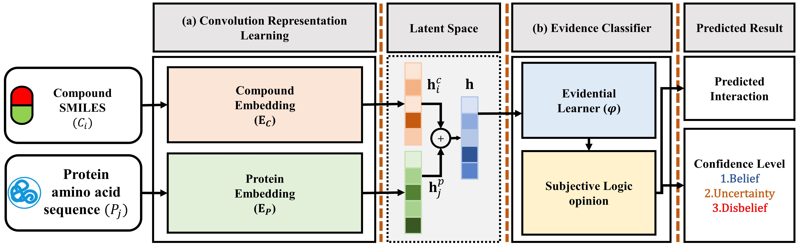
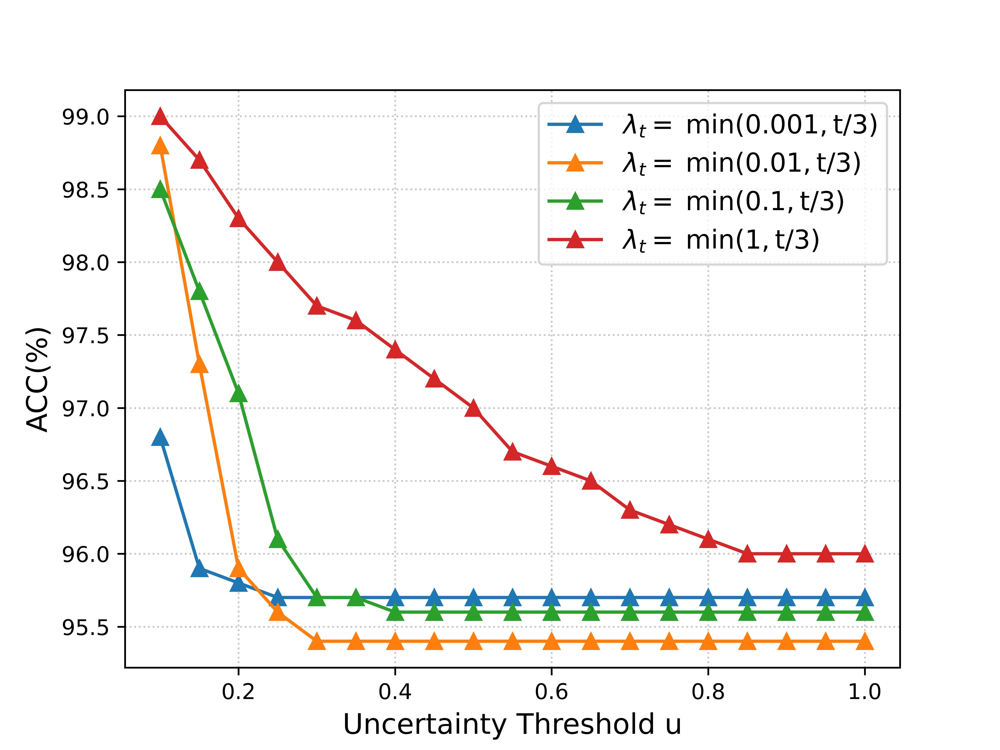
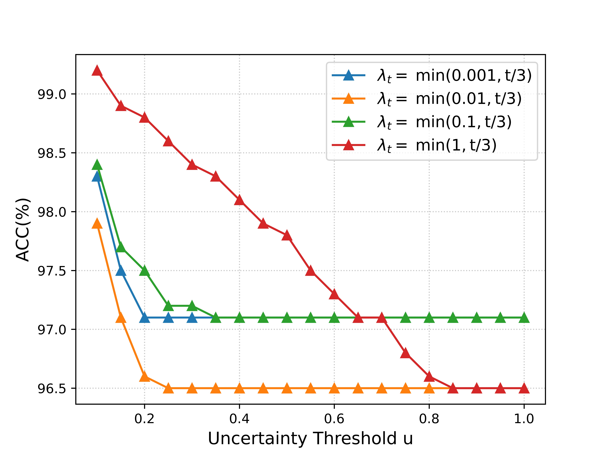

# TrustworthyCPI: Trustworthy Compound–Protein Interaction Prediction

This code is an implementation of our paper
" Trustworthy Compound–Protein Interaction Prediction" in PyTorch. In this repository, we provide two CPI datasets:
Human and C.elegans created by
"[Improving compound–protein interaction prediction by building up highly credible negative samples (Bioinformatics, 2015).](https://academic.oup.com/bioinformatics/article/31/12/i221/216307)"

In our problem setting of TrustworthyCPI prediction, the input of our model is the pair of a SMILES format of compound
and an amino acid sequence of protein and the outputs are not only a binary prediction result interaction but also the
the confidence level of prediction result. The overview of our **TrustworthyCPI Model** is as follows:


The details of the TrustworthyCPI Model are described in our paper.

## Characteristics of the repository

- We provide the **several demo-scripts** of the experiments in the paper, so that you can quickly understand the
  trustworthy
  prediction process of the TrustworthyCPI model.
- This code is **easy to use**. It means that you can customize your own dataset and train your own TrustworthyCPI
  prediction
  model, and apply it to the new "trustworthy drug discovery" scenario.
- We provide **several pre-training models** on Human and C.elegans datasets for your further researches.

## Table of contents

- [Requirements](#requirements)
- [Data Preparation](#data-preparation)
- [(a) Case Study](#a-case-study-trustworthy-drug-discovery-on-sars-cov2-3clpro)
- [(b) Uncertainty estimation](#b-uncertainty-estimation)
- [(c) OOD (Out-Of-Distribution) Detection](#c-ood-out-of-distribution-detection)
- [(d) Parameters Selection](#d-parameters-selection)
- [(e) Training on Human and C.elegans Benchmark](#e-training-of-trustworthycpi-model-on-benchmark-datasets-in-an-end-to-end-manner)
- [(f) Training using customized CPI dataset](#f-Training-of-TrustworthyCPI-Model-using-your-customized-CPI-dataset-and-make-trustworthy-drug-discovery)

## Requirements

- torch==1.10.0
- Numpy==1.21.5
- Scikit-learn==1.0.2
- RDKit==2020.09.1.0
- setuptools==65.4.0

## Data Preparation

Due to the large size of the pre-processed dataset (~420MB), we have stored
it [here](https://drive.google.com/file/d/1lE0fE0RTqP3ThxVorPhA9FMP9ZR6WiOC/view?usp=drive_link). Please download this
zip file and extract it to the main directory as the `/data` folder.

- The explanation for the file directory:
    - The Human and C.elegans datasets are respectively saved in the `/CelegansByStr` and `/Human` directories.
    - `data.txt` contains the SMILES sequences and their labels from the original dataset.
    - `train.txt` and `test.txt` are random divisions of the dataset (Each of them has a ratio of pos:Neg = 1:5).
    - `train_IndexVec_data.npy` (training set) and `train_IndexVec_data.npy` (testing set) store the pre-processed
      Encoding Vector of C-P pairs (please refer to **Section 3.2 Convolutional Representation Learning** in the paper).
    - The source code for data preprocessing can be found in
      script [data_preprocess.py](data%2FCelegansByStr%2Fdata_preprocess.py).

## (a) Case Study (Trustworthy drug discovery on SARS CoV2 3CLPro)

**This script employs TrustworthyCPI to predict the SARS-CoV2 3CPro Protease and its existing 85 drugs, including 82
antiviral drugs and 3 unrelated drugs.**

(For the detailed description of this experiment, please refer to **4.7 Case Study** in the paper.)

- Run the script [drugs_trustworthy_predict.py](case_study/drugs_trustworthy_predict.py) for trustworthy drug discovery
  on SARS CoV2 3CLPro.
- Description of the `case_study` file directory:
    - Antiviral drugs are stored in `antiviral_data/antiviral_drugs.txt`
    - Unrelated drugs are stored in `antiviral_data/unrelated_drugs.txt`.
    - One can also download the original antiviral drugs and unrelated ones using the
      script [load_antiviral_drugs.py](case_study%2Fload_antiviral_drugs.py).
    - We have combined all SMILES sequences of drugs and amino acid sequences of SARS-CoV2 3CPro Protease in the
      file `antiviral_data/existing_drugs_3CLPro_pair.txt`, and then transformed them into Encoding Vectors using
      the [data_helper.py](case_study/data_helper.py) script (please refer to "Section 3.2 Convolutional Representation
      Learning" of the paper).
    - A TrustworthyCPI model trained on the full C.elegans dataset is stored in `model_trained_on_Celegans.pth`.

<details>
  <summary>Click here for the results!</summary>

```
Trustworthy Drug Discovery Result for SARS-CoV2 3CL Protease
+------+----------------------+-------------+------------------------+----------------------+
| Rank |      Drug_Name       | Interaction |      Probability       |     Uncertainty      |
+------+----------------------+-------------+------------------------+----------------------+
|  1   |      Cobicistat      |     YES     |          1.0           | 0.08056621998548508  |
|  2   |      Sofosbuvir      |     YES     |          1.0           | 0.09978272765874863  |
|  3   |     Grazoprevir      |     YES     |   0.9999995231628418   | 0.12084315717220306  |
|  4   |      Lopinavir       |     YES     |   0.9999973773956299   | 0.13479585945606232  |
|  5   |      Maraviroc       |     YES     |   0.999990701675415    |  0.1472548395395279  |
|  6   |      Ritonavir       |     YES     |   0.9999873638153076   | 0.15061740577220917  |
|  7   |      Amprenavir      |     YES     |   0.9999854564666748   | 0.15222729742527008  |
|  8   |      Vicriviroc      |     YES     |   0.9999790191650391   | 0.15657827258110046  |
|  9   |    Fosamprenavir     |     YES     |   0.9999722242355347   | 0.15950043499469757  |
|  10  |      Letermovir      |     YES     |   0.9999697208404541   | 0.16121140122413635  |
|  11  |      Darunavir       |     YES     |   0.9999691247940063   | 0.16148033738136292  |
|  12  |      Remdesivir      |     YES     |   0.9995914101600647   | 0.20403088629245758  |
|  13  |      Saquinavir      |     YES     |   0.9993853569030762   | 0.21290338039398193  |
|  14  |      Foscarnet       |     YES     |   0.9985707998275757   |  0.2339385598897934  |
|  15  |      Telaprevir      |     YES     |   0.9983593821525574   |  0.2010272592306137  |
|  16  |     Daclatasvir      |     YES     |   0.9981291890144348   |  0.2063629925251007  |
|  17  |      Tipranavir      |     YES     |   0.9841045141220093   | 0.19573618471622467  |
|  18  |     Rilpivirine      |     YES     |   0.9790443778038025   | 0.15529493987560272  |
|  19  |       Adefovir       |     YES     |   0.9688928127288818   | 0.14851942658424377  |
|  20  |     Glecaprevir      |     YES     |   0.905486524105072    | 0.21173739433288574  |
|  21  |      Boceprevir      |     YES     |   0.7066730260848999   | 0.15546026825904846  |
|  22  |      Indinavir       |      NO     |  0.009367047809064388  | 0.18778075277805328  |
|  23  |      Etravirine      |      NO     | 0.0009644171223044395  | 0.13998864591121674  |
|  24  |      Peramivir       |      NO     | 0.00016467933892272413 | 0.11879550665616989  |
|  25  |      Simeprevir      |      NO     | 4.344771150499582e-05  | 0.13806137442588806  |
|  26  |      Doravirine      |      NO     | 7.302066478587221e-06  | 0.11595325917005539  |
|  27  |      Efavirenz       |      NO     | 5.0562639444251545e-06 | 0.13604062795639038  |
|  28  |     Elvitegravir     |      NO     |  2.1288449261192e-06   | 0.09184033423662186  |
|  29  |     Zalcitabine      |      NO     | 5.353192591428524e-07  | 0.09474369138479233  |
|  30  |      Ribavirin       |      NO     | 4.402370734624128e-08  | 0.07295691967010498  |
|  31  |      Pleconaril      |      NO     | 1.5305635869822254e-08 | 0.09400348365306854  |
|  32  | Tenofovir_disoproxil |      NO     | 1.010846073512539e-08  | 0.07316455990076065  |
|  33  |       Arbidol        |      NO     | 4.022041810713972e-09  | 0.09375815838575363  |
|  34  |      Lamivudine      |      NO     | 1.6988835893627652e-09 | 0.09011731296777725  |
|  35  |      Nelfinavir      |      NO     | 1.196819532367499e-09  | 0.08871698379516602  |
|  36  |     Raltegravir      |      NO     | 1.1846462699693916e-09 | 0.08042722195386887  |
|  37  |     Oseltamivir      |      NO     | 4.642930484521912e-10  | 0.08514077961444855  |
|  38  |      Atazanavir      |      NO     | 2.3937030135812165e-10 |  0.0773882046341896  |
|  39  |      Baloxavir       |      NO     |  9.56685702879767e-11  | 0.07977620512247086  |
|  40  |   Podophyllotoxin    |      NO     | 1.9823488336956352e-11 | 0.07506337016820908  |
|  41  |     Dolutegravir     |      NO     |  7.53349552878868e-12  | 0.06664511561393738  |
|  42  |     Bictegravir      |      NO     | 1.7600688701630007e-12 | 0.06880970299243927  |
|  43  |       Loviride       |      NO     | 4.684839213613123e-13  | 0.06581269204616547  |
|  44  |      Cidofovir       |      NO     | 1.1102960727465278e-13 | 0.06283582001924515  |
|  45  |     Delavirdine      |      NO     | 1.0704509652813277e-13 |  0.0627637505531311  |
|  46  |     Penciclovir      |      NO     | 4.687500658896032e-14  | 0.06117837131023407  |
|  47  |  Hydroxychloroquine  |      NO     | 2.6587603578725853e-14 | 0.060135308653116226 |
|  48  |     Methisazone      |      NO     | 9.331097059037032e-15  | 0.058299820870161057 |
|  49  |     Chloroquine      |      NO     | 8.779341491261475e-15  | 0.05819642171263695  |
|  50  |     Valacyclovir     |      NO     | 7.282774033899424e-15  | 0.05788164958357811  |
|  51  |      Nevirapine      |      NO     | 2.8178240821144073e-15 | 0.05633356794714928  |
|  52  |       Aspirin        |      NO     | 1.879640648856651e-15  | 0.05569836497306824  |
|  53  |     Nitazoxanide     |      NO     | 1.4003089391701785e-15 | 0.05524544045329094  |
|  54  |     Rimantadine      |      NO     | 1.0830121970737305e-15 | 0.05485609546303749  |
|  55  |      Entecavir       |      NO     | 9.142414117289032e-16  | 0.05460238456726074  |
|  56  |     Tromantadine     |      NO     | 1.8789944950667938e-16 | 0.052341461181640625 |
|  57  |      Amantadine      |      NO     | 1.1294451138741128e-16 | 0.05165337771177292  |
|  58  |      Zidovudine      |      NO     | 6.863771345908633e-17  | 0.05099739506840706  |
|  59  |     Enfuvirtide      |      NO     | 4.849240461973718e-17  | 0.050549570471048355 |
|  60  |      Pyrimidine      |      NO     | 1.6818598519536457e-17 | 0.04923192411661148  |
|  61  |    Emtricitabine     |      NO     |  9.83335685872727e-18  | 0.048589978367090225 |
|  62  |      Edoxudine       |      NO     | 8.649912865070103e-18  | 0.04843907058238983  |
|  63  |       Abacavir       |      NO     | 1.0318954064507137e-18 | 0.04606688395142555  |
|  64  |       Descovy        |      NO     | 2.5430853677027354e-19 | 0.04462717846035957  |
|  65  |      Tenofovir       |      NO     | 2.5430853677027354e-19 | 0.04462717846035957  |
|  66  |     Famciclovir      |      NO     | 1.845469414915127e-19  | 0.044310152530670166 |
|  67  |      Penicillin      |      NO     | 1.3352844463728797e-19 | 0.04399474710226059  |
|  68  |      Stavudine       |      NO     | 3.8197481702988356e-20 | 0.04281599447131157  |
|  69  |      Aciclovir       |      NO     |  3.81487006650676e-20  | 0.042814821004867554 |
|  70  |      Imiquimod       |      NO     | 3.7398140887926566e-20 | 0.04279661551117897  |
|  71  |     Taribavirin      |      NO     | 5.548250546904428e-21  | 0.04111774265766144  |
|  72  |       Inosine        |      NO     | 3.4351970734017615e-21 | 0.04071643576025963  |
|  73  |      Docosanol       |      NO     | 2.1571670801936046e-21 | 0.04033437743782997  |
|  74  |     Ibacitabine      |      NO     | 5.167394358367084e-22  | 0.039204537868499756 |
|  75  |    Valganciclovir    |      NO     | 3.0890780782141243e-22 | 0.03881309553980827  |
|  76  |      Moroxydine      |      NO     | 2.153293659552999e-22  | 0.03854316473007202  |
|  77  |      Vidarabine      |      NO     | 1.5737614762623245e-22 |  0.0383116789162159  |
|  78  |      Didanosine      |      NO     |  9.26801596424501e-24  | 0.036340199410915375 |
|  79  |      Zanamivir       |      NO     | 1.126411429729075e-24  | 0.03499991074204445  |
|  80  |     Trifluridine     |      NO     | 1.4770005431014706e-25 | 0.033798277378082275 |
|  81  |     Ganciclovir      |      NO     | 2.4736024056267565e-27 | 0.03161349520087242  |
|  82  |     Telbivudine      |      NO     | 1.7103415768094214e-31 | 0.027456142008304596 |
|  83  |      Amoxicillin     |      NO     | 3.0067233019826624e-34 | 0.025256657972931862 |
|  84  |     Idoxuridine      |      NO     | 2.9860802895675288e-34 | 0.02525446005165577  |
|  85  |       Imunovir       |      NO     |          0.0           | 0.01636103354394436  |
+------+----------------------+-------------+------------------------+----------------------+

```

</details>

## (b) Uncertainty estimation

**This script evaluates the uncertainty estimation performance of the TrustworthyCPI model on the C.elegans and Human
datasets.**

(For the detailed description of this
experiment, please refer to **4.4 Uncertainty Estimation Performance** in the paper.)

- Run the script [uncertainty_evaluation.py](uncertainty_estimation_expirement/uncertainty_evaluation.py) to filter out
  the trustworthy
  prediction datapoints and only give the prediction results for them.
- Models and Datasets:
    - Two models trained using Hunam and C.elegans have been saved in the `/results` folder.
    - The test data is saved under the name `test_IndexVec_data.npy` in the corresponding `/data` folder (this is a data
      format that the model can directly input).
- Uncertainty Estimation Process:
    - (1) The model predicts the entire dataset.
    - (2) Use `0.1, 0.15, ..., 0.95` as uncertainty thresholds for filtering.
    - (3) Evaluate the proportion and accuracy of the filtered data points and prediction accuracy.
- Note: The ratio of positive to negative sample points for all data is 1:5.

<details>
  <summary>Click here for the results!</summary>

```
-------------------- Uncertainty_Testing_On_Celegans_Dataset --------------------
+---------------------+-------------------------------+--------------------+--------------------+
|      threshold      | Number of filtered datapoints |     Proportion     |        ACC         |
+---------------------+-------------------------------+--------------------+--------------------+
|         0.1         |              3215             | 0.6844794549712583 | 0.991912841796875  |
| 0.15000000000000002 |              3872             | 0.8243559718969555 | 0.9888945817947388 |
| 0.20000000000000004 |              4161             | 0.8858846071960826 | 0.9875029921531677 |
| 0.25000000000000006 |              4291             | 0.9135618479880775 | 0.9855511784553528 |
| 0.30000000000000004 |              4371             | 0.9305939961677666 | 0.9842141270637512 |
|  0.3500000000000001 |              4433             | 0.9437939110070258 | 0.9828558564186096 |
| 0.40000000000000013 |              4493             | 0.9565680221417926 | 0.9806365370750427 |
| 0.45000000000000007 |              4525             | 0.9633808814136683 | 0.9790055155754089 |
|  0.5000000000000001 |              4554             | 0.9695550351288056 | 0.9778217077255249 |
|  0.5500000000000002 |              4586             | 0.9763678944006813 | 0.9753597974777222 |
|  0.6000000000000002 |              4610             | 0.981477538854588  | 0.9731019735336304 |
|  0.6500000000000001 |              4622             | 0.9840323610815415 | 0.9712245464324951 |
|  0.7000000000000002 |              4638             | 0.9874387907174792 | 0.9706770181655884 |
|  0.7500000000000002 |              4665             | 0.9931871407281243 | 0.967845618724823  |
|  0.8000000000000002 |              4682             | 0.9968064722163082 | 0.9658265113830566 |
|  0.8500000000000002 |              4687             | 0.9978709814775388 | 0.9654363393783569 |
|  0.9000000000000002 |              4697             |        1.0         | 0.9646583199501038 |
|  0.9500000000000003 |              4697             |        1.0         | 0.9646583199501038 |
+---------------------+-------------------------------+--------------------+--------------------+
-------------------- Uncertainty_Testing_On_Human_Dataset --------------------
+---------------------+-------------------------------+--------------------+--------------------+
|      threshold      | Number of filtered datapoints |     Proportion     |        ACC         |
+---------------------+-------------------------------+--------------------+--------------------+
|         0.1         |              2971             | 0.7348503586445708 | 0.989902389767755  |
| 0.15000000000000002 |              3392             | 0.8389809547365817 | 0.9867334905660378 |
| 0.20000000000000004 |              3610             | 0.8929013109077418 | 0.9831024930747922 |
| 0.25000000000000006 |              3743             | 0.9257976749938165 | 0.9799625968474486 |
| 0.30000000000000004 |              3824             | 0.945832302745486  | 0.9769874476987448 |
|  0.3500000000000001 |              3865             | 0.9559732871629978 | 0.9759379042690814 |
| 0.40000000000000013 |              3893             | 0.9628988374969082 | 0.9740559979450295 |
| 0.45000000000000007 |              3917             | 0.9688350234974029 | 0.9719172836354353 |
|  0.5000000000000001 |              3937             | 0.9737818451644819 | 0.9700279400558801 |
|  0.5500000000000002 |              3954             | 0.9779866435814989 | 0.9668689934243804 |
|  0.6000000000000002 |              3970             | 0.981944100915162  | 0.9659949622166247 |
|  0.6500000000000001 |              3978             | 0.9839228295819936 | 0.9650578179989945 |
|  0.7000000000000002 |              3986             | 0.9859015582488251 | 0.9628700451580532 |
|  0.7500000000000002 |              3998             | 0.9888696512490724 | 0.9619809904952477 |
|  0.8000000000000002 |              4006             | 0.990848379915904  | 0.9610584123814279 |
|  0.8500000000000002 |              4018             | 0.9938164729161514 | 0.9599303135888502 |
|  0.9000000000000002 |              4043             |        1.0         | 0.9599307444966609 |
|  0.9500000000000003 |              4043             |        1.0         | 0.9599307444966609 |
+---------------------+-------------------------------+--------------------+--------------------+

```

</details>

## (c) OOD (Out-Of-Distribution) Detection

**This script evaluates the OOD data
detection capability of the TrustworthyCPI model.**

(For the detailed description of this
experiment, please refer to **4.5 OOD (Out-Of-Distribution) Detection** in the paper)

- Run the script [OOD_detection_evaluation.py](uncertainty_estimation_expirement/OOD_detection_evaluation.py) to to
  evaluate the OOD datapoints.
- The model and dataset used are consistent with those in **[(b) Uncertainty estimation](#b-uncertainty-estimation).**
- The only difference is:
    - The Human testing set is used to test the model trained on C.elegans.
    - Conversely, the C.elegans testing set is used to test the model trained on Human.
- Intuitively, the prediction uncertainty u of OOD data should be higher than
  that of ID (In Distribution) data.
- For example, when we train the model on C.elegans, the uncertainty u of C.elegans
  test datapoints should be lower than that of Human in general .

<details>
  <summary>Click here for the results!</summary>

```
-------------------- Celegans->Celegans (In Distribution) --------------------
+---------------------+--------------------------------+--------------------+--------------------+
|         0.1         |              3215              | 0.6844794549712583 | 0.991912841796875  |
| 0.15000000000000002 |              3872              | 0.8243559718969555 | 0.9888945817947388 |
| 0.20000000000000004 |              4161              | 0.8858846071960826 | 0.9875029921531677 |
| 0.25000000000000006 |              4291              | 0.9135618479880775 | 0.9855511784553528 |
| 0.30000000000000004 |              4371              | 0.9305939961677666 | 0.9842141270637512 |
|  0.3500000000000001 |              4433              | 0.9437939110070258 | 0.9828558564186096 |
| 0.40000000000000013 |              4493              | 0.9565680221417926 | 0.9806365370750427 |
| 0.45000000000000007 |              4525              | 0.9633808814136683 | 0.9790055155754089 |
|  0.5000000000000001 |              4554              | 0.9695550351288056 | 0.9778217077255249 |
|  0.5500000000000002 |              4586              | 0.9763678944006813 | 0.9753597974777222 |
|  0.6000000000000002 |              4610              | 0.981477538854588  | 0.9731019735336304 |
|  0.6500000000000001 |              4622              | 0.9840323610815415 | 0.9712245464324951 |
|  0.7000000000000002 |              4638              | 0.9874387907174792 | 0.9706770181655884 |
|  0.7500000000000002 |              4665              | 0.9931871407281243 | 0.967845618724823  |
|  0.8000000000000002 |              4682              | 0.9968064722163082 | 0.9658265113830566 |
|  0.8500000000000002 |              4687              | 0.9978709814775388 | 0.9654363393783569 |
|  0.9000000000000002 |              4697              |        1.0         | 0.9646583199501038 |
|  0.9500000000000003 |              4697              |        1.0         | 0.9646583199501038 |
+---------------------+--------------------------------+--------------------+--------------------+
-------------------- Celegans->Human (Out of Distribution) --------------------
+---------------------+--------------------------------+--------------------+--------------------+
|      threshold      | Number of filtered data points |     Proportion     |        ACC         |
+---------------------+--------------------------------+--------------------+--------------------+
|         0.1         |              1637              | 0.4048973534504081 | 0.9407452940940857 |
| 0.15000000000000002 |              2365              | 0.5849616621320801 | 0.9395349025726318 |
| 0.20000000000000004 |              2803              | 0.6932970566411081 | 0.9389939308166504 |
| 0.25000000000000006 |              3002              | 0.7425179322285431 | 0.9320453405380249 |
| 0.30000000000000004 |              3157              | 0.7808558001484046 | 0.9249287843704224 |
|  0.3500000000000001 |              3293              | 0.8144941874845412 | 0.9198299646377563 |
| 0.40000000000000013 |              3408              | 0.8429384120702449 | 0.9107981324195862 |
| 0.45000000000000007 |              3498              | 0.8651991095720999 | 0.9036592245101929 |
|  0.5000000000000001 |              3580              | 0.8854810784071234 | 0.8930167555809021 |
|  0.5500000000000002 |              3660              | 0.9052683650754391 | 0.8844262361526489 |
|  0.6000000000000002 |              3727              | 0.9218402176601533 | 0.8760397434234619 |
|  0.6500000000000001 |              3807              | 0.941627504328469  | 0.8655109405517578 |
|  0.7000000000000002 |              3873              | 0.9579520158298294 | 0.8587657809257507 |
|  0.7500000000000002 |              3936              | 0.9735345040811278 | 0.8523882031440735 |
|  0.8000000000000002 |              3989              | 0.986643581498887  | 0.8503383994102478 |
|  0.8500000000000002 |              4019              | 0.9940638139995053 | 0.8502114415168762 |
|  0.9000000000000002 |              4043              |        1.0         | 0.8501113057136536 |
|  0.9500000000000003 |              4043              |        1.0         | 0.8501113057136536 |
+---------------------+--------------------------------+--------------------+--------------------+
-------------------- Human->Human (In Distribution) --------------------
+---------------------+-------------------------------+--------------------+--------------------+
|      threshold      | Number of filtered datapoints |     Proportion     |        ACC         |
+---------------------+-------------------------------+--------------------+--------------------+
|         0.1         |              2971             | 0.7348503586445708 | 0.989902389767755  |
| 0.15000000000000002 |              3392             | 0.8389809547365817 | 0.9867334905660378 |
| 0.20000000000000004 |              3610             | 0.8929013109077418 | 0.9831024930747922 |
| 0.25000000000000006 |              3743             | 0.9257976749938165 | 0.9799625968474486 |
| 0.30000000000000004 |              3824             | 0.945832302745486  | 0.9769874476987448 |
|  0.3500000000000001 |              3865             | 0.9559732871629978 | 0.9759379042690814 |
| 0.40000000000000013 |              3893             | 0.9628988374969082 | 0.9740559979450295 |
| 0.45000000000000007 |              3917             | 0.9688350234974029 | 0.9719172836354353 |
|  0.5000000000000001 |              3937             | 0.9737818451644819 | 0.9700279400558801 |
|  0.5500000000000002 |              3954             | 0.9779866435814989 | 0.9668689934243804 |
|  0.6000000000000002 |              3970             | 0.981944100915162  | 0.9659949622166247 |
|  0.6500000000000001 |              3978             | 0.9839228295819936 | 0.9650578179989945 |
|  0.7000000000000002 |              3986             | 0.9859015582488251 | 0.9628700451580532 |
|  0.7500000000000002 |              3998             | 0.9888696512490724 | 0.9619809904952477 |
|  0.8000000000000002 |              4006             | 0.990848379915904  | 0.9610584123814279 |
|  0.8500000000000002 |              4018             | 0.9938164729161514 | 0.9599303135888502 |
|  0.9000000000000002 |              4043             |        1.0         | 0.9599307444966609 |
|  0.9500000000000003 |              4043             |        1.0         | 0.9599307444966609 |
+---------------------+-------------------------------+--------------------+--------------------+
-------------------- Human->Celegans (Out of Distribution) --------------------
+---------------------+-------------------------------+---------------------+--------------------+
|      threshold      | Number of filtered datapoints |      Proportion     |        ACC         |
+---------------------+-------------------------------+---------------------+--------------------+
|         0.1         |              896              | 0.19076005961251863 | 0.9720982313156128 |
| 0.15000000000000002 |              1985             | 0.42261017670853734 | 0.9682619571685791 |
| 0.20000000000000004 |              2609             |  0.5554609325101129 | 0.9601380228996277 |
| 0.25000000000000006 |              3022             |  0.6433893974877581 | 0.9487094283103943 |
| 0.30000000000000004 |              3326             |  0.708111560570577  | 0.9326518177986145 |
|  0.3500000000000001 |              3583             |  0.7628273365978284 | 0.9098520278930664 |
| 0.40000000000000013 |              3757             |  0.7998722588886523 | 0.8972584009170532 |
| 0.45000000000000007 |              3932             |  0.8371300830317224 | 0.8802136182785034 |
|  0.5000000000000001 |              4067             |  0.8658718330849479 | 0.8701745271682739 |
|  0.5500000000000002 |              4210             |  0.8963167979561422 | 0.8581947684288025 |
|  0.6000000000000002 |              4352             |  0.9265488609750905 | 0.8481158018112183 |
|  0.6500000000000001 |              4455             |  0.9484777517564403 | 0.8401795625686646 |
|  0.7000000000000002 |              4526             |  0.9635937832659144 | 0.8340697884559631 |
|  0.7500000000000002 |              4591             |  0.9774324036619119 | 0.8307557702064514 |
|  0.8000000000000002 |              4632             |  0.9861613796040025 | 0.8296632170677185 |
|  0.8500000000000002 |              4675             |  0.9953161592505855 | 0.8297325968742371 |
|  0.9000000000000002 |              4697             |         1.0         | 0.8301043510437012 |
|  0.9500000000000003 |              4697             |         1.0         | 0.8301043510437012 |
+---------------------+-------------------------------+---------------------+--------------------+

```

</details>

## (d) Parameters Selection

**This script run the ablation experiment in our paper.**

(please refer to **4.2 Factors of Influencing the Performance of TrustworthyCPI** in the paper for the details),

- we found that when the feature learning module consists of 3-layer convolutional neural network, and the annealing
  coefficient of the regularized term is set to `λ_t=min(1,t/3)`, the model can obtain the best uncertainty prediction
  performance. You can also try to adjust these two factors based on your own dataset to
  achieve better performance.
- For the detailed parameters of the feature learning module, please refer to **Section 3.2 Convolutional Representation
  Learning** in the paper.
- The pre-trained 1-layer and 2-layer convolutional neural network models are saved in the `/ablation_conv_models`
  folder. you can use them for the further researches. Please refer
  to [Ablation_model.py](ablation_conv_models%2FAblation_model.py) for the source files of its structure.
- For the other hyperparameters related to optimization, please refer to **(4.1 Experimental Setup and Baselines)** in
  the paper。

<details>
  <summary>Click here for the detailed effect of the annealing coefficient!</summary>

Effect of the different sizes of the annealing coefficient on the performance of uncertainty prediction

|                        Human Dataset                         |                        C.elegans Dataset                        |
|:------------------------------------------------------------:|:---------------------------------------------------------------:|
|  |  |

</details>

## (e) Training of trustworthyCPI model on benchmark datasets in an end-to-end manner

- **Step-1:** Execute the [run_training.py](run_training.py) script using the following command to train
  the TrustworthyCPI model on the Human dataset. The results will be outputted to the `/result` directory.
    ```bash
    python run_training.py --dataset Human
    ```

- **Step-2:** Execute the [run_prediction.py](run_prediction.py) script to perform uncertainty prediction, which will
  print the predictive performance on this dataset such as ACC, AUC, AUPRC, etc.

    ```bash
    python run_prediction.py --dataset Human
    ```

    - Note that due to enviroment differences, there may be some deviation in the results. We believe that the standard
      deviation should be kept within `± 0.5 %` of the results reported in Table 4 and Table 5 in the paper.
    - Please try to run `run_training.py` on your own instead of directly using our checkpoints to reproduce our
      experiments. This may ensure the correctness of your experimental process.

- **Step-3:** Check the `/result` directory, the prediction results for each data point will be saved
  as `Human_output.csv`.
    - `Label` column: the true label of the data point.
    - `Probability` column: the predicted interacting score of the data point.
    - `pred_label` column: the predicted label of the data point.
    - `uncertainty` column: the uncertainty u of the data point. This is calculated by Eq. (3) in the paper.

<details>
  <summary>Click here for the results!</summary>
Human_output.csv

|   Pair   |  Label  |       Probability        |  Pred Label  |      Uncertainty       |
|:--------:|:-------:|:------------------------:|:------------:|:----------------------:|
|  Pair1   |    0    |  4.737482287740618e-26   |      0       |  0.03316105902194977   |
|  Pair2   |    0    |  3.970345518784001e-22   |      0       |  0.03900306671857834   |
|  Pair3   |    0    |  3.7335040614649984e-10  |      0       |  0.08435791730880737   |
|  Pair4   |    0    |  3.6831488614552654e-07  |      0       |  0.11894617974758148   |
|  Pair5   |    0    |  3.0627700198238017e-07  |      0       |  0.11765553057193756   |
|  Pair6   |    0    |  1.1848506506847599e-15  |      0       |  0.054991647601127625  |
|  Pair7   |    1    |    0.9999750852584839    |      1       |  0.15873946249485016   |
|  Pair8   |    0    |  1.6332719046644362e-15  |      0       |  0.055481284856796265  |
|  Pair9   |    0    |  2.8190175515370886e-15  |      0       |   0.056334238499403    |
|  Pair10  |    0    |  4.239310271714203e-07   |      0       |  0.11994942277669907   |
|  Pair11  |    0    |  1.9672363578138174e-06  |      0       |  0.13211017847061157   |
|   ...    |   ...   |           ...            |     ...      |          ...           |

</details>

- **Step-4:** Train TrustworthyCPI on the unbalance datasets.
    - Download the unbalanced datasets used in the experiment (Pos/Neg = 1:1, 1:3, 1:5) from [here](https://drive.google.com/file/d/1RVZ6ZtjOdJrlFIUCCasJhTWTtpsJZAZZ/view?usp=sharing).
    - Unzip it to the `/unbalanced_data` folder.
    - Modify the [run_training.py](run_training.py) and [run_prediction.py](run_prediction.py) scripts appropriately.
    - Train and predict in the same way as Step 1~3.

## (f) Training of TrustworthyCPI Model using your customized CPI dataset and make trustworthy drug discovery

**We recommend you to run demo (e) to reproduce our experiment before attempting to train the TrustworthyCPI model
using your own custom CPI dataset to familiarize yourself with the training and prediction processes of the
TrustworthyCPI.**

**- Step-1: Raw data format**

  - Please refer to `data/CelegansByStr/data.txt` file to store your Compound-Protein pairs in rows according to the
following format.
  - (SMILES of Compound,Sequence of Protein,Interaction):

```
CCNC(C)CC1=CC(=CC=C1)C(F)(F)F,MHRASLICRLASPSRINAIRNASSGKSHISASTLVQHRNQSVAAAVKHEPFLNGSSSIYIEQMYEAWLQDPSSVHTSWDAYFRNVEAGAGPGQAFQAPPATAYAGALGVSPAAAQVTTSSAPATRLDTNASVQSISDHLKIQLLIRSYQTRGHNIADLDPLGINSADLDDTIPPELELSFYGLGERDLDREFLLPPTTFISEKKSLTLREILQRLKDIYCTSTGVEYMHLNNLEQQDWIRRRFEAPRVTELSHDQKKVLFKRLIRSTKFEEFLAKKWPSEKRFGLEGCEVLIPAMKQVIDSSSTLGVDSFVIGMPHRGRLNVLANVCRQPLATILSQFSTLEPADEGSGDVKYHLGVCIERLNRQSQKNVKIAVVANPSHLEAVDPVVMGKVRAEAFYAGDEKCDRTMAILLHGDAAFAGQGVVLETFNLDDLPSYTTHGAIHIVVNNQIGFTTDPRSSRSSPYCTDVGRVVGCPIFHVNVDDPEAVMHVCNVAADWRKTFKKDVIVDLVCYRRHGHNELDEPMFTQPLMYQRIKQTKTALEKYQEKILNEGVANEQYVKEELTKYGSILEDAYENAQKVTYVRNRDWLDSPWDDFFKKRDPLKLPSTGIEQENIEQIIGKFSQYPEGFNLHRGLERTLKGRQQMLKDNSLDWACGEALAFGSLLKEGIHVRLSGQDVQRGTFSHRHHVLHDQKVDQKIYNPLNDLSEGQGEYTVCNSSLSEYAVLGFELGYSMVDPNSLVIWEAQFGDFSNTAQCIIDQFISSGQSKWIRQSGLVMLLPHGYEGMGPEHSSARPERFLQMCNEDDEIDLEKIAFEGTFEAQQLHDTNWIVANCTTPANIYHLLRRQVTMPFRKPAVVFSPKSLLRHPMARSPVEDFQSGSNFQRVIPETGAPSQNPPDVKRVVFCTGKVYYDMVAARKHVGKENDVALVRVEQLSPFPYDLVQQECRKYQGAEILWAQEEHKNMGAWSFVQPRINSLLSIDGRATKYAGRLPSSSPATGNKFTHMQEQKEMMSKVFGVPKSKLEGFKA,0
C1CNCCN(C1)S(=O)(=O)C2=CC=CC3=C2C=CN=C3,MSRRSTTTSTNFGLSWSLVDVISSSTAVFKVPMNGGCDLWIGCARWLRDMKVLTTDKNGTMLEFASVLRDGILLCRLANTLVPNGIDQKKIMRTNQPSPFLCCNNINYFAMFCKTYFNLEDADLFTAEDLYYMNGFQKVLKTLSFLSHTKESLSRGVDPFPDTDNNQEGTSNGSEFEDDVEIYQSLHDNIENVDPNRTIYGPITSADPEEQQSEQLYDRIVTNRKPSMNENDLQNTPTLKRNRCIRELYDTEKNYVAQALVTIIKTFYEPLKGIIPTSDYNIIFGNIEEINVLHTALLADLEYPVKVALGLSDATPPRPISLNECVPQTIGEVFIKYRDQFLAYGKYCSNLPDSRKLSNELLKTNEFISRNINELTAQGNCKFGMNDLLCVPFQRLTKYPLLLKELQKKTDLASPDRKSLEEAVEVMEDVCNYINEESRDTNAIKVIDEIEQSITDLSMPLNVKLHDYGRVNLDGEVKMAESTLTQAGKPKQRYIFLFDKVIVVCKAANKVMAAKTTGASARTNTFTYKNAYVMSELTIDKNASLDVKSGGTITRRTQYVIIMTRDRNENNEITQLTFYFKNEATRNNWMTALLLSKSNVSPTDYLRDTNHKVAFHSFRVDVKNPATCDVCDKLMKGLQYQGYKCESCNMSMHKECLGLKKCEAVRKSTHETRSSQSFNCNRPRFHIHEGDIVVANSNSTPSDLSYLQFAKGDRIEVIKMQGHNRFTGCLINNRNRTGLVHLDHVSQSRTTSMIGLSPIDSPAGSIAPRVVRNESTVLPNKLLSDGSSRSLSGPHGSRSSRNSSSSTINGSMDSVPRQQDYVNTEISEFLWYMGEMERAKAESTLKGTPNGTFLVRYSKNRKQTAISLSYKNDVKHMIIEQNSDGKVYLDEDYIFNSTVELVQYYRSNNLIEIFAALDTCLKNPYSQCKVFKAVHDYDAPSPNNEGKFLSFKTGDIVVLLDTVGEDRGWWKGQVNNKSGFFPLSYVKPYDPATEGSSSPVTPTSSSS,0
C1=CC=C(C=C1)C(=O)Cl,MSTENGKSADAPVAAPAAKELTSKDYYFDSYAHFGIHEEMLKDEVRTTTYRNSIYHNSHLFKDKVVMDVGSGTGILSMFAAKAGAKKVFAMEFSNMALTSRKIIADNNLDHIVEVIQAKVEDVHELPGGIEKVDIIISEWMGYCLFYESMLNTVLVARDRWLAPNGMLFPDKARLYVCAIEDRQYKEDKIHWWDSVYGFNMSAIKNVAIKEPLVDIVDNAQVNTNNCLLKDVDLYTVKIEDLTFKSDFKLRCTRSDYIQAFVTFFTVEFSKCHKKTGFSTGPDVQYTHWKQTVFYLKDALTVKKGEEITGSFEMAPNKNNERDLDINISFDFKGEVCDLNEQNTYTMH,0
C1C2C(C(C(O2)N3C4=NC=NC(=C4N=C3Br)N)O)OP(=O)(O1)[O-],MEAVAEHDFQAGSPDELSFKRGNTLKVLNKDEDPHWYKAELDGNEGFIPSNYIRMTECNWYLGKITRNDAEVLLKKPTVRDGHFLVRQCESSPGEFSISVRFQDSVQHFKVLRDQNGKYYLWAVKFNSLNELVAYHRTASVSRTHTILLSDMNVETKFVQALFDFNPQESGELAFKRGDVITLINKDDPNWWEGQLNNRRGIFPSNYVCPYNSNKSNSNVAPGFNFGN,0
C1=CC=C2C(=C1)NC3=CC=CC=C3S2,MFARIVSRRAATGLFAGASSQCKMADRQVHTPLAKVQRHKYTNNENILVDHVEKVDPEVFDIMKNEKKRQRRGLELIASENFTSKAVMDALGSAMCNKYSEGYPGARYYGGNEFIDQMELLCQKRALEVFGLDPAKWGVNVQPLSGSPANFAVYTAIVGSNGRIMGLDLPDGGHLTHGFFTPARKVSATSEFFQSLPYKVDPTTGLIDYDKLEQNAMLFRPKAIIAGVSCYARHLDYERFRKIATKAGAYLMSDMAHISGLVAAGLIPSPFEYSDVVTTTTHKSLRGPRGALIFYRKGVRSTNAKGVDTLYDLEEKINSAVFPGLQGGPHNHTIAGIAVALRQCLSEDFVQYGEQVLKNAKTLAERMKKHGYALATGGTDNHLLLVDLRPIGVEGARAEHVLDLAHIACNKNTCPGDVSALRPGGIRLGTPALTSRGFQEQDFEKVGDFIHEGVQIAKKYNAEAGKTLKDFKSFTETNEPFKKDVADLAKRVEEFSTKFEIPGNETF,0
[Mg+2],MAAPWTPLESNPSVINPMIEKMGVSGVKTVDVLFFDDESIGKPQHAVILCFPEYKKVDEIMKPIYEQAKAADDSVFFMKQKISNACGTFALFHSLANLEDRINLGDGSFAKWLAEAKKVGIEERSDFLANNAELAGIHAAAATDGQTAPSGDVEHHFICFVGKNGILYEIDSRRPFAREIGPTSDATLVKDAGAACQHLIEKLDNVSFSAIAVVNQ,1
...
```

**- Step-2: Data preprocessing**

  - Run file [data_preprocess.py](data/CelegansByStr/data_preprocess.py) to convert the original data to Encoding Vector 
  - Please refer to **Section 3.2 Convolutional Representation Learning** for the details).

```
[   2   80   81  115  164  284  ...],[11.  9. 18.  1. 17. 12.  ...],0
[ 306  315  351  367  379  393  ...],[11. 17. 18. 18. 17. 20. ...],0
[ 390  651  808 1089 1200 1293  ...],[11. 17. 20.  4. 14.  6. ...],0
[ 180  201  210  222  379  394  ...],[11.  4.  1. 22.  1.  4. ...],0
[ 199  398  463  676  950 1061  ...],[11.  7.  1. 18.  8. 22. ...],0
[273   0   0   0   0   0   0   0 ...],[11.  1.  1. 16. 21. 20. ...],1
```

**- Step-3: Encapsulate your own torch dataset**

Refer to the file [MyData.py](MyUtils/MyData.py) and encapsulate your own dataset into the Class `torch.utils.data.Dataset`
recommended by Pytorch.

**- Step-4: Training**

Run the file [run_training.py](run_training.py) to train and save your own TrustworthyCPI Model.

**- Step-5: Trustworthy Drug discovery**

  - Store and preprocess your Compound-Protein pairs to be predicted as described above.
  - Use file 
[drugs_trustworthy_predict.py](case_study%2Fdrugs_trustworthy_predict.py) for your own **trustworthy drug discovery**！

## Disclaimer

- **_Please manually verify the reliability of the results by experts before conducting further drug experiments._**
- **_Do not
directly use these drugs for disease treatment._**

## Thanks

Thanks for the support of the following repositories:

|                             Source                              |                    Detail                     |
|:---------------------------------------------------------------:|:---------------------------------------------:|
| https://github.com/dougbrion/pytorch-classification-uncertainty |      Implement of Evidence Loss Function      |
|               https://github.com/hkmztrk/DeepDTA                | Implement of Protein Character Encoding Table |

## Cite us

If you found this work useful to you, please cite our paper:

```
@article{XXX,
  title={TrustworthyCPI: Trustworthy Compound–Protein Interaction Prediction},
  author={XXX},
  journal={XXX},
  year={2023}
}
```
